## Ponderada de Programação Semana 02
### Objetivo: 
&nbsp;&nbsp;&nbsp;&nbsp;Descrever pelo menos 5 casos de teste para as principais funcionalidades de uma DHT com pré-condição, etapas do teste e pós-condição.

Caso queira ir direto para os [caso de teste](#casos-de-teste)


### Ambiente Atual:
&nbsp;&nbsp;&nbsp;&nbsp;Ao rodar `.\main.exe`, executamos o arquivo compilado da Tabela Hash Distribuida. Os seguintes RA's estão organizados de acordo com o menor módulo da diferença entre o RA do aluno e o ID do nó.
    <div align= "center">
        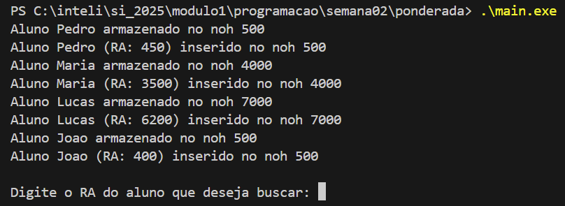
    </div>

&nbsp;&nbsp;&nbsp;&nbsp;Após isso, o terminal possibilita a entrada de um dado, RA do aluno, para encontrar o nó associado:
    <div align= "center">
        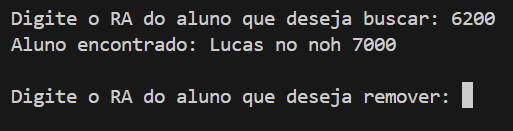
    </div>

&nbsp;&nbsp;&nbsp;&nbsp;O terminal, de novo, requisita a entrada de um RA para remover o aluno que está associado a ele. Vale ressaltar que um mapa, associado ao atributo `keyValueStore`, armazena os nós seus respectivos alunos, então, quando a função remove um aluno ela está deletando a chave, nó, com o valor correspondente ao RA do aluno. E por fim é emitido o estado atual de `keyValueStore`
    <div align= "center">
        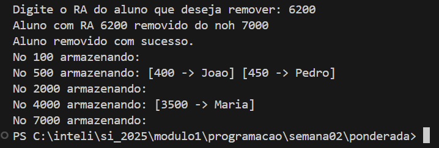
    </div>

## Casos de Teste 

### Primeiro Caso de Teste
&nbsp;&nbsp;&nbsp;&nbsp;**Pré-Condição:** Para testar o algoritmo de inserção da classe `ChordNode`, novos
nós foram criados:
<div align= "center">
        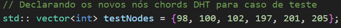
</div>

```
std:: vector<int> testNodes = {98, 100, 102, 197, 201, 205};
```
&nbsp;&nbsp;&nbsp;&nbsp;**Etapas do Teste:** Ao executar `main.exe`, na qual chama a função `inserirAlunos`, o seguinte output foi gerado:   
    <div align= "center">
        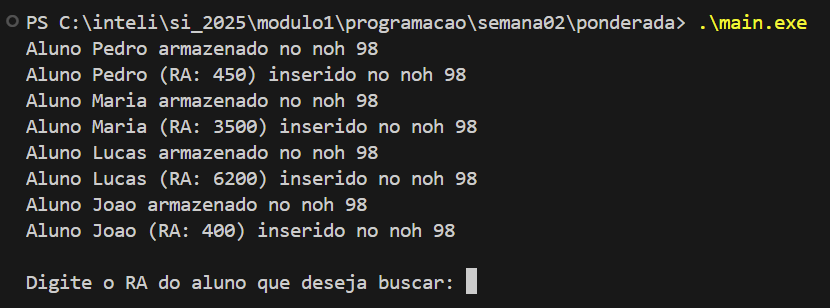
    </div>
&nbsp;&nbsp;&nbsp;&nbsp;**Pós-Condição:** Percebe-se que todos os RA's foram armazenados no nó 98, o que não corresponde a prosta das DHT. Isso é causado pela falha de verificação para nós de ID menores que os RA's dos alunos.

### Segundo Caso de Teste
&nbsp;&nbsp;&nbsp;&nbsp;**Pré-Condição:** Para testar o algoritmo inserção da classe `ChordNode`, novos RA's e nós foram criados:
<div align= "center">
    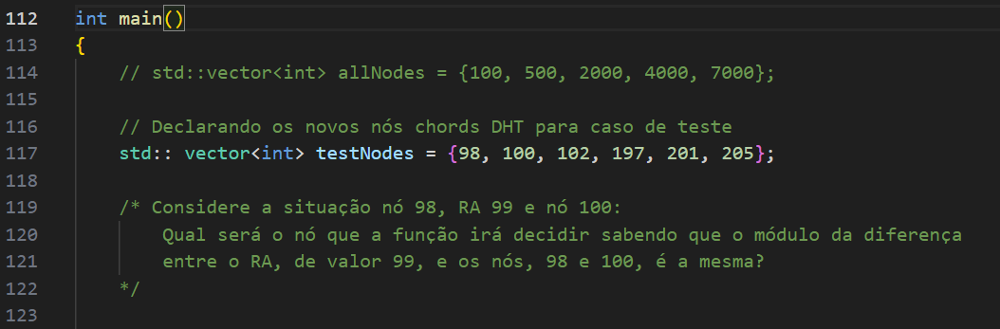
    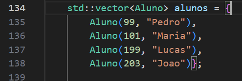
</div>

```
std:: vector<int> testNodes = {98, 100, 102, 197, 201, 205};

std::vector<Aluno> alunos = {
        Aluno(99, "Pedro"),
        Aluno(101, "Maria"),
        Aluno(199, "Lucas"),
        Aluno(203, "Joao")};
```

&nbsp;&nbsp;&nbsp;&nbsp;**Etapas do Teste:** Ao executar `main.exe`, na qual chama a função `inserirAlunos`, o seguinte output foi gerado:   
    <div align= "center">
        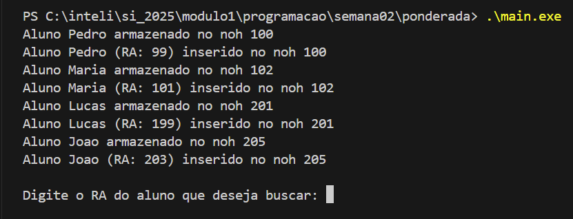
    </div>
&nbsp;&nbsp;&nbsp;&nbsp;**Pós-Condição:** Percebe-se que os RA's foram armazenados no nó de ID maior, apesar do módulo da diferença entre os outros nós ser o memo. A lógica, apresentada na imagem abaixo, prova isso:
<div align= "center">
        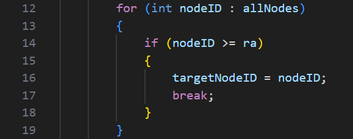
</div>

### Terceiro Caso de Teste
&nbsp;&nbsp;&nbsp;&nbsp;**Pré-Condição:** Mesma do [segundo caso de teste](#segundo-caso-de-teste)

&nbsp;&nbsp;&nbsp;&nbsp;**Etapas do Teste:** Ao executar `main.exe`, na qual chama a função `buscarAluno`, os seguinte output foi gerado:   
    <div align= "center">
        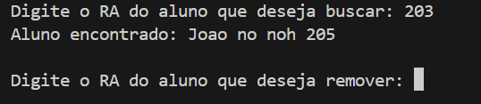
    </div>
&nbsp;&nbsp;&nbsp;&nbsp;**Pós-Condição:** Assim, é possível certificar que o algoritimo de busca da classe Chord foi bem implementado para RA's menores que os ID's dos nós.
<div align= "center">
        
</div>

### Quarto Caso de Teste
&nbsp;&nbsp;&nbsp;&nbsp;**Pré-Condição:** Mesma do [segundo caso de teste](#segundo-caso-de-teste)

&nbsp;&nbsp;&nbsp;&nbsp;**Etapas do Teste:** Ao executar `main.exe`, na qual chama a função `removerAluno`, os seguinte output foi gerado:   
    <div align= "center">
        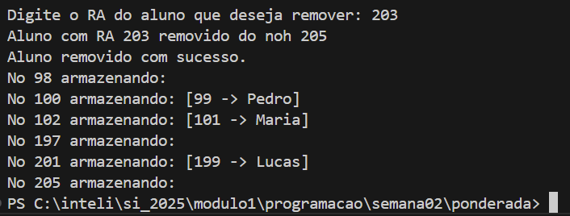
    </div>
&nbsp;&nbsp;&nbsp;&nbsp;**Pós-Condição:** Assim, é possível certificar que o algoritimo de remoção da classe Chord foi bem implementado para RA's menores que os ID's dos nós.
<div align= "center">
        
</div>

### Quinto Caso de Teste
&nbsp;&nbsp;&nbsp;&nbsp;**Pré-Condição:** Para testar o algoritimo de inserção da classe `Chord`, ID's de uma unidade a menos que o valor dos RA's e um ID de valor superior a todos os RA's foram criados:

```
    std:: vector<int> testNodes = {449, 3499, 6199, 399, 10000};

    std::vector<Aluno> alunos = {
        Aluno(450, "Pedro"),
        Aluno(3500, "Maria"),
        Aluno(6200, "Lucas"),
        Aluno(400, "Joao")}

```

&nbsp;&nbsp;&nbsp;&nbsp;**Etapas do Teste:** Ao executar `main.exe`, na qual chama a função `inserirAlunos`, os seguinte output foi gerado:   
    <div align= "center">
        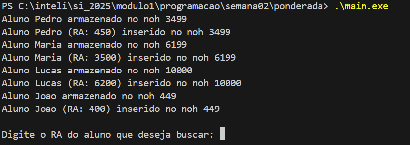
    </div>

&nbsp;&nbsp;&nbsp;&nbsp;**Pós-Condição:** Depois de analisar o output gerado pela função `inserirAlunos`, foi identificado a falha do algoritimo para selecionar o nó de ID mais próximo do ao RA's, mesmo que o ID eja uma unidade menor que o RA. Assim, concluindo que o algoritimo prioriza o ID mais próximo e maior que o RA do aluno.

### Conclusão
&nbsp;&nbsp;&nbsp;&nbsp; A partir dos casos de teste, foi possível identificar falhas no algoritimo de inserção da classe Chord e da função `inserirAlunos`, comprometendo a integridade da DHT. 


   
